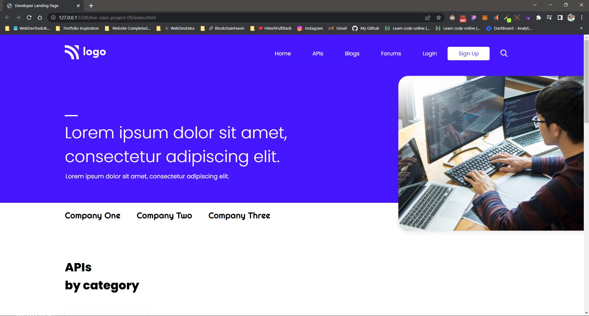

# Live Class from Hitesh

## Class about hosting websites

In this class we discussed about hosting websites also we talked about pushing code to git and github.
But you can you vercel to host your website.

[Vercel](https://vercel.com/)

# Here's my Website's Screenshot

