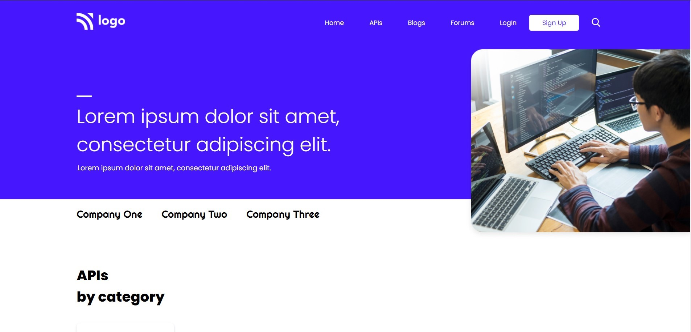

# Project 9 - HTML  and CSS 

By Shubham

Here's the Live Deployed Website 

## [DEPLOYED WEBSITE LINK](https://jsdevportfolio.netlify.app/)

## What I learned from this Project?

- I learned about **Layout** making through **Flexbox**.
- I also learned how to use **Icons**.
- I also learned how to design **Full Website End to End**.
- I also learned how to use **Offset Some Images**.
- I also learned about **Box Shadow**.
- I also learned how to use **Hover Effect**.

## This project took around **10 hours** to complete.
